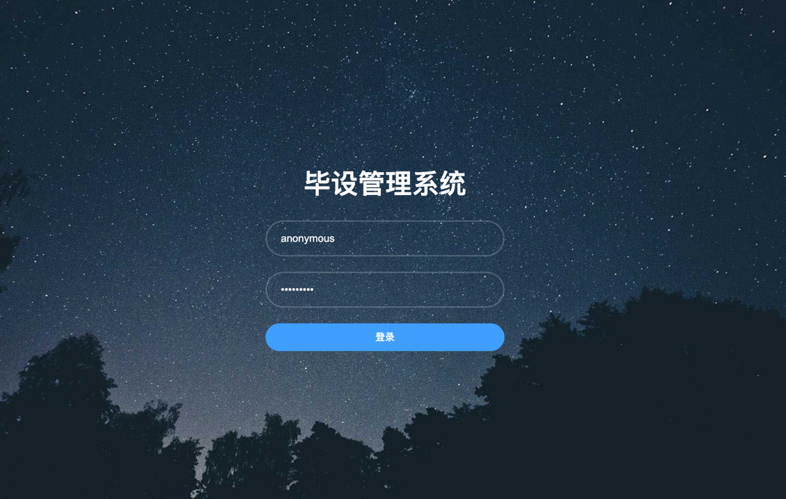
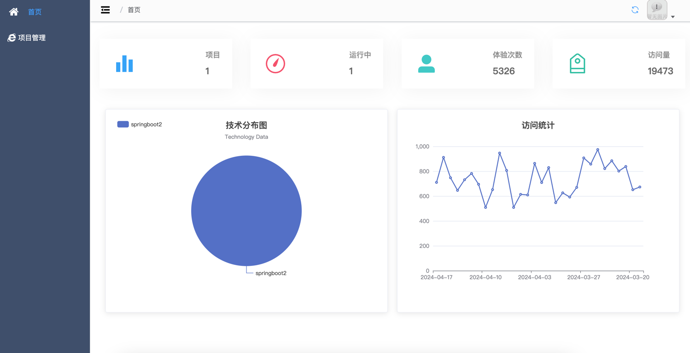
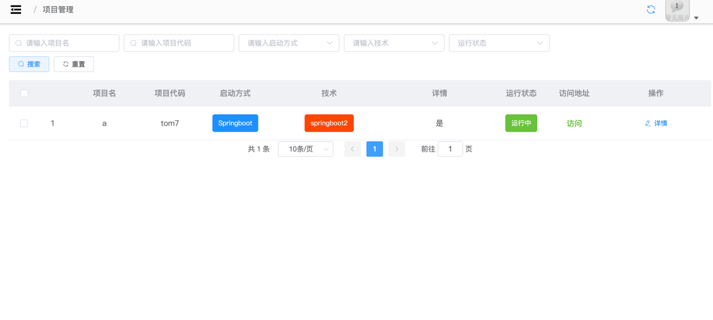

毕设管理系统

## 介绍
毕设管理系统，接入宝塔控制一键启动毕设
全部采用docker-compose启动：jar，tomcat，node等  
注意：宝塔配置，开启API接口，开启白名单，拿到秘钥  

宝塔版本：免费版 8.0.6  

## 技术栈
* 部署可选：dockerfile，docker-compose，nginx   
* 框架：springboot3，vue2+vuex+vue-router，mysql8，redis  
* 技术：mybatis-plus，lombok，mapstruct，jwt，easypoi  
* 接口文档：knife4j-openapi3
* 使用mapstruct，对reqVo-resVo-entity等进行互转  

## 目录结构
├─gpms-common    公共工具类  
├─gpms-generator 代码生成模块  
├─gpms-system    系统模块  
├─gpms-server    启动模块，新业务模块放在这里  
├─gpms-ui        vue2项目

## 安装教程
gpms-server 中的`Application.java`为main启动类
#### 后端
1. 导入`/sql/gpms-mysql8.sql`
2. 配置 yml 的mysql，redis 的ip、密码。默认选择`application-dev.yml`
3. 直接启动，页面账号admin，密码111111
#### 前端
gpms-ui 中的`README.md`为前端文档
1. 安装`nodejs16`（15也可以，高版本没试过）
2. 配置npm镜像源`npm config set registry https://registry.npm.taobao.org`
3. 进入`/gpms-ui`目录，执行`npm install`，安装依赖
4. 执行`npm run serve`，启动vue项目

#### 文件上传下载目录
上传文件，用户头像等，存储在项目主目录下的`gpms-file`文件夹，可在`配置文件`中修改
#### 接口文档
[http://localhost:8081/gpms/doc.html](https://localhost:8081/gpms/doc.html)  
注：携带token的问题，找到文档管理-全局参数设置，然后输入Authorization，参数为登录接口返回的token，复制即可

#### 示例图片

